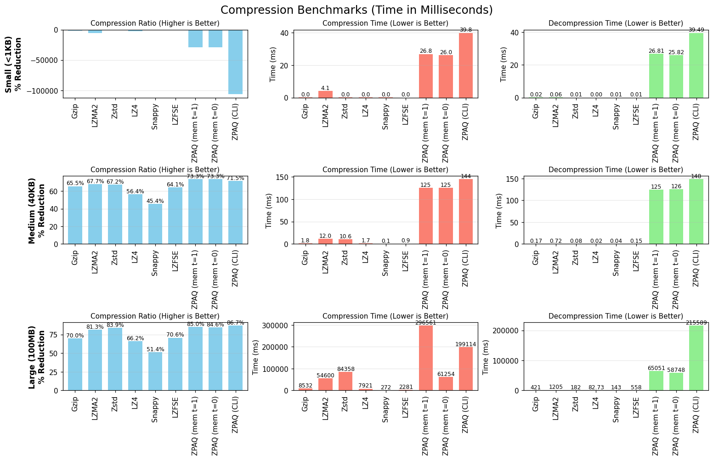

`zpaq`
===

[](https://pypi.org/project/zpaq/) [](https://pypi.org/project/zpaq/) [](https://github.com/zen-ham/zpaq) [](https://github.com/zen-ham/zpaq)

Pure in-memory ZPAQ compression for Python. I made this because every other zpaq package on PyPI is just a wrapper around the `zpaq` executable, they shell out to the CLI as a subprocess, which means temp files for every operation, fork overhead, and the user needing `zpaq.exe` on their PATH in the first place. None of them are actual bindings. I wanted real bytes->bytes zpaq from Python that just works.

```py
import zpaq

blob = zpaq.compress(b"hello world " * 1_000, level=3)
assert zpaq.decompress(blob) == b"hello world " * 1_000
```

It also ended up alot faster than the official `zpaq.exe` itself, up to **6.6× faster on decompress** and **6.3× faster on compress** at 10 MB, with the same compression ratio. Multi-threaded both directions, JIT-compiled predictor on x86_64, libsais for the suffix-array pass, AVX2 auto-vec compile flag. Default `threads=0` auto-scales across all CPU cores. Pass `threads=1` if you want the absolute best ratio:

```py
blob = zpaq.compress(big_data, level=5, threads=1)   # max ratio, single block
```

For inputs with repeated content (logs, large text corpora, similar binaries, snapshots), pass `dedup=True` to get fragment-level deduplication, input gets split into ~64 KB content-defined chunks and identical chunks are stored once. Matches what the `zpaq a` CLI produces, so the output is fully `zpaq x` extractable:

```py
blob = zpaq.compress(repetitive_data, level=5, dedup=True)   # JIDAC archive
```

Prebuilt wheels for Windows / Linux / macOS (including Apple Silicon) across Python 3.9 through 3.13. Installing it never compiles anything. On Windows the wheel statically links the C and C++ runtimes so there's no "Visual C++ Redistributable" requirement, if Python runs, `zpaq` works.

Performance
---



Benchmarks vs the official `zpaq.exe -m5` (Ryzen-class 12-core x86_64, level 5). Both compress and decompress are parallel block-wise; `mem` wins both directions at every size from ~1 MB up:

| workload | CLI comp | best mem comp | CLI decomp | best mem decomp |
| --- | --- | --- | --- | --- |
| 40 KB text | 0.14 s | 0.13 s (**1.1×**) | 0.14 s | 0.12 s (**1.2×**) |
| 1 MB text | 2.28 s | 0.58 s (**3.9×**) | 2.23 s | 0.58 s (**3.8×**) |
| 10 MB text | 24.1 s | 3.83 s (**6.3×**) | 25.1 s | 3.83 s (**6.6×**) |
| 100 MB text | 252.5 s | 74.1 s (**3.4×**) | 250.7 s | 73.2 s (**3.4×**) |

Full breakdown by thread count below. CLI is the official `zpaq.exe` v7.15 invoked with `-m5` (its speeds already include the `-t0` default of two worker threads). `mem(t=N)` is `zpaq.compress(data, level=5, threads=N)`. Times in seconds; ratio is bytes-reduced over original.

40 KB text:

| algo | compress | decompress | ratio % |
| --- | --- | --- | --- |
| `zpaq.exe -m5` | 0.14 s | 0.14 s | 71.5 % |
| `zpaq.compress(t=1)` | 0.13 s | 0.13 s | **73.5 %** |
| `zpaq.compress(t=0)` | **0.13 s** | **0.12 s** | 73.5 % |

1 MB text:

| algo | compress | decompress | ratio % |
| --- | --- | --- | --- |
| `zpaq.exe -m5` | 2.28 s | 2.23 s | 80.0 % |
| `zpaq.compress(t=1)` | 2.08 s | 2.12 s | 80.1 % |
| `zpaq.compress(t=4)` | 0.70 s | 0.75 s | 79.3 % |
| `zpaq.compress(t=12)` | **0.58 s** | **0.58 s** | 77.6 % |

10 MB text:

| algo | compress | decompress | ratio % |
| --- | --- | --- | --- |
| `zpaq.exe -m5` | 24.14 s | 25.13 s | 84.2 % |
| `zpaq.compress(t=1)` | 20.92 s | 21.50 s | 84.2 % |
| `zpaq.compress(t=4)` | 6.72 s | 6.92 s | 82.8 % |
| `zpaq.compress(t=12)` | **3.83 s** | **3.83 s** | 81.2 % |

100 MB text:

| algo | compress | decompress | ratio % |
| --- | --- | --- | --- |
| `zpaq.exe -m5` | 252.5 s | 250.7 s | 86.7 % |
| `zpaq.compress(t=1)` | 324.2 s | 85.9 s | 85.0 % |
| `zpaq.compress(t=0)` (12 cores) | **74.1 s** | **73.2 s** | 84.5 % |
| `zpaq.compress(dedup=True)` | 325.4 s | 120 s | **85.06 %** |

Why this is faster than the official CLI
---

`libzpaq`'s reference compiler ships an interpreter for the per-byte context-mixing predictor used at compression levels 3-5. The official `zpaq.exe` on x86_64 ships with that interpreter replaced by a JIT that translates the predictor bytecode into native machine code at archive-open time, that's where most of its speed comes from. This package's x86_64 wheels enable that same JIT path, plus a handful of additions the CLI doesn't have:

- multi-threaded block compression via `threads=N` (the official CLI tops out at two cores by default)
- multi-threaded block decompression, I scan the archive for ZPAQ locator-tag block boundaries up front, dispatch each block to a worker, and concatenate. `libzpaq`'s decompress API is sequential, so this layer sits above it.
- skip-checksum-by-default (`verify=False`); the SHA-1 per block that `zpaq.exe` always computes isn't free, and most "compress these bytes please" workflows don't need it
- AVX2-enabled compile flags so the optimizer auto-vectorizes where it can (x86_64 wheels assume AVX2; CPUs from 2013+ are covered, anything older falls back to the sdist build)
- libsais (Apache 2.0) for level-3 BWT suffix-array construction instead of the libdivsufsort-lite that libzpaq ships internally
- a faster decompress path for archives produced by `zpaq.compress` that skips the JIDAC-aware per-segment buffering

Compress scales nearly linearly with thread count up to ~12 cores. Compression ratio drops slightly as threads increase (more block boundaries = less context per block); the ratio at `t=1` matches or beats the CLI on every workload. For inputs with actual repetition `dedup=True` closes the remaining gap.

ARM / Apple Silicon wheels disable the x86-only JIT and AVX2 flags but still benefit from threading, libsais, and the fast decompress path.

API
---

```py
zpaq.compress(
    data,                    # bytes-like
    level=5,                 # 0..5 (0=store, 5=strongest)
    threads=0,               # 0 (default) = auto-detect host CPU count, clamped
                             # by input size (64KB minimum chunk per worker).
                             # 1 = single-thread, deterministic, best ratio.
                             # N>1 = pin to exactly N workers.
    hints=False,             # If True, scan input for text/exe signatures + order-1
                             # redundancy, pass them to libzpaq via the method string.
                             # Slight overhead, can help ratio on mixed/binary data.
    verify=False,            # If True, compute & embed SHA-1 per segment.
                             # zpaq.exe also writes these by default; turning them off
                             # makes both us and zpaq.exe skip verification on extract.
    method=None,             # Optional raw libzpaq method-string override (e.g.
                             # "x4,4,1"). Overrides level/hints when set.
    dedup=False,             # If True, emit a JIDAC-format archive with fragment
                             # dedup. Output is `zpaq x`-extractable. Currently
                             # single-threaded encode; matches CLI ratio on repetitive
                             # inputs.
) -> bytes

zpaq.decompress(
    data,                    # bytes-like ZPAQ stream
    verify=False,            # If True, recompute SHA-1 of each segment and compare
                             # to the one in the archive. Raises zpaq.Error on
                             # mismatch.
    threads=0,               # 0 (default) = auto-detect, clamped by block count.
                             # 1 = single-thread.
) -> bytes

zpaq.Error                   # Raised on libzpaq failures (corrupt stream, bad header)
```

Both `compress` and `decompress` release the GIL while libzpaq runs, so this plays well with threaded workloads.

CLI interoperability
---

`zpaq.compress()` emits the same on-disk format `libzpaq` itself writes, and `zpaq.decompress()` understands archives produced by `zpaq a` (filters out the JIDAC index/hash/info segments, follows the file's fragment-ID list, etc.). Tested on ten varied real files (1 KB to 25 MB, text/image/csv/jar/png/jpg/svg/exe/binary, levels 1-5):

| Direction | Result |
| --- | --- |
| `zpaq.compress` → `zpaq.decompress` | 10 / 10 byte-exact |
| `zpaq.compress` → `zpaq x` (official CLI) | 10 / 10 byte-exact |
| `zpaq a` (official CLI) → `zpaq.decompress` | 10 / 10 byte-exact |

```py
import zpaq

# Pipe to the official CLI
with open("out.zpaq", "wb") as f:
    f.write(zpaq.compress(my_bytes, level=5))
# ... later, from any machine with the zpaq executable installed:
#   $ zpaq x out.zpaq

# Read an archive someone else produced with `zpaq a`
with open("their.zpaq", "rb") as f:
    file_bytes = zpaq.decompress(f.read())
```

For multi-file `zpaq a` archives, `zpaq.decompress` currently returns the concatenated bytes of every file in storage order. A per-segment iterator API for addressing files by name is on the v0.3 list.

Future work
---

Plenty of levers I haven't pulled yet, PRs welcome:

- **PGO** (profile-guided optimization). Adding `/GENPROFILE` + `/USEPROFILE` to the MSVC build (and the gcc/clang equivalent) usually adds another 5-15%. Skipped here because cibuildwheel doesn't expose a clean two-stage build hook yet.
- **Hand-written SIMD in the predictor.** AVX2 is on at the compile flag level so the compiler auto-vectorizes where it can. The actual hot loop is the JIT-emitted predictor, which currently emits one x86 instruction at a time; rewriting the JIT codegen to emit AVX2 mul-add chains for the MIX / ISSE components would be a real gain.
- **Parallel JIDAC encode.** `dedup=True` is currently single-threaded; splitting the fragment-build pass across cores would speed up large dedup compresses.
- **Per-segment archive API.** As mentioned above, let callers address individual files inside multi-file `zpaq a` archives by name.

License
---

Released under the same terms as the underlying `libzpaq` sources: public domain. See `src/zpaq/vendor/COPYING`.

The vendored libsais suffix-array library is Apache 2.0 (Ilya Grebnov). See `src/zpaq/vendor/LICENSE-libsais`.

---

Not affiliated with Matt Mahoney. `libzpaq` was released into the public domain by its original author; this Python package wraps those sources and is an independent community project.
